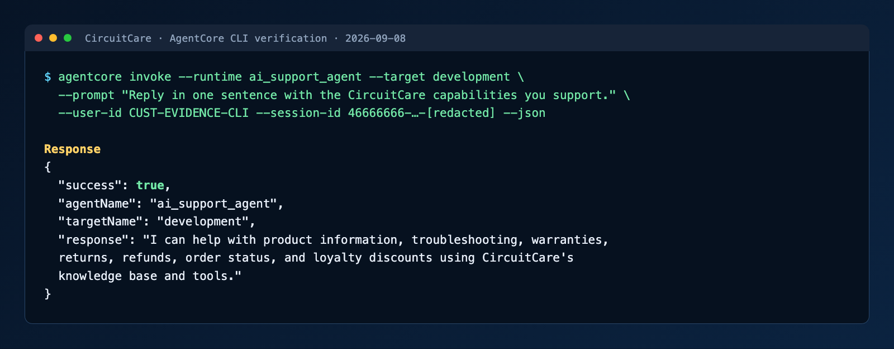
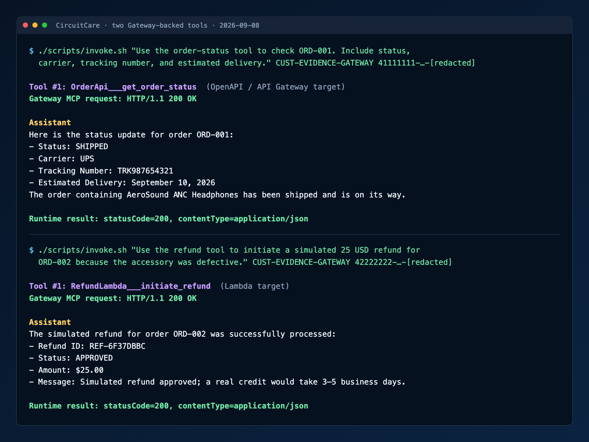
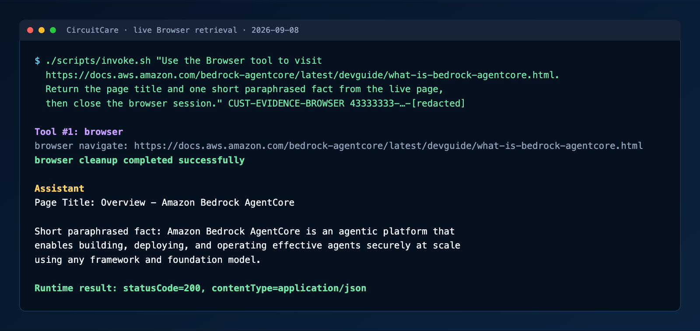
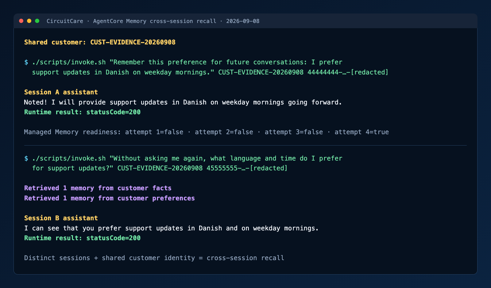

# Live Agent Verification Log

These transcripts were captured from the deployed CircuitCare agent in AWS
`us-east-1` on 2026-09-08. Relevant prompt, response, and tool-trace fields are
preserved, while AWS account IDs, ARNs, resource endpoints, request IDs, and
local paths are omitted. All customers and commerce records shown here are
fictional.

The images below are terminal-style renderings of these sanitized live
transcripts. They preserve the tested commands, tool names, response content,
and success status without publishing deployment identifiers.

## AgentCore CLI invocation



```text
$ agentcore invoke --runtime ai_support_agent --target development \
    --prompt "Reply in one sentence with the CircuitCare capabilities you support." \
    --user-id CUST-EVIDENCE-CLI \
    --session-id 46666666-6666-4666-8666-[redacted] --json

{
  "success": true,
  "agentName": "ai_support_agent",
  "targetName": "development",
  "response": "I can help with product information, troubleshooting, warranties, returns, refunds, order status, and loyalty discounts using CircuitCare's knowledge base and tools.",
  "sessionId": "46666666-6666-4666-8666-[redacted]"
}
```

## Gateway tool 1: API-based order lookup



```text
Session: 41111111-1111-4111-8111-[redacted]
User: Use the order-status tool to check ORD-001. Include status, carrier,
      tracking number, and estimated delivery.

CloudWatch tool trace:
2026-09-08T13:30:57Z Tool #1: OrderApi___get_order_status
2026-09-08T13:30:58Z Gateway MCP request: HTTP/1.1 200 OK

Assistant: Here is the status update for order ORD-001:
- Status: SHIPPED
- Carrier: UPS
- Tracking Number: TRK987654321
- Estimated Delivery: September 10, 2026
The order containing AeroSound ANC Headphones has been shipped and is on its way.

Runtime result: statusCode=200, contentType=application/json
```

`OrderApi___get_order_status` is supplied by the Gateway OpenAPI/API Gateway
target.

## Gateway tool 2: Lambda-based refund

```text
Session: 42222222-2222-4222-8222-[redacted]
User: Use the refund tool to initiate a simulated 25 USD refund for ORD-002
      because the accessory was defective.

CloudWatch tool trace:
2026-09-08T13:30:56Z Tool #1: RefundLambda___initiate_refund
2026-09-08T13:30:57Z Gateway MCP request: HTTP/1.1 200 OK

Assistant: The simulated refund for order ORD-002 was successfully processed:
- Refund ID: REF-6F37DBBC
- Status: APPROVED
- Amount: $25.00
- Message: Simulated refund approved; a real credit would take 3–5 business days.
- Created at: September 8, 2026, 13:30:57 UTC

Runtime result: statusCode=200, contentType=application/json
```

`RefundLambda___initiate_refund` is supplied by the Gateway Lambda target. It
does not perform a real financial transaction.

## Browser retrieval from a live page



```text
Session: 43333333-3333-4333-8333-[redacted]
User: Use the Browser tool to visit
      https://docs.aws.amazon.com/bedrock-agentcore/latest/devguide/what-is-bedrock-agentcore.html.
      Return the page title and one short paraphrased fact from the live page,
      then close the browser session.

CloudWatch tool trace:
2026-09-08T13:31:16Z Tool #1: browser
2026-09-08T13:31:20Z browser navigate: https://docs.aws.amazon.com/bedrock-agentcore/latest/devguide/what-is-bedrock-agentcore.html
2026-09-08T13:32:42Z browser cleanup completed successfully

Assistant response excerpt:
Page Title: Overview - Amazon Bedrock AgentCore
Short paraphrased fact: Amazon Bedrock AgentCore is an agentic platform that
enables building, deploying, and operating effective agents securely at scale
using any framework and foundation model.

Runtime result: statusCode=200, contentType=application/json
```

## Cross-session memory recall



Both invocations use customer `CUST-EVIDENCE-20260908`, but their session IDs
are different.

```text
Session A: 44444444-4444-4444-8444-[redacted]
User: Remember this preference for future conversations: I prefer support
      updates in Danish on weekday mornings.
Assistant: Noted! I will provide support updates in Danish on weekday mornings
           going forward.
Runtime result: statusCode=200

Managed-memory readiness check:
attempt=1 preference_ready=false
attempt=2 preference_ready=false
attempt=3 preference_ready=false
attempt=4 preference_ready=true

Session B: 45555555-5555-4555-8555-[redacted]
User: Without asking me again, what language and time do I prefer for support
      updates?

CloudWatch memory trace:
2026-09-08T13:34:52Z Retrieved 1 memory from customer facts
2026-09-08T13:34:52Z Retrieved 1 memory from customer preferences

Assistant response excerpt: I can see that you prefer support updates in Danish
                            and on weekday mornings.
Runtime result: statusCode=200
```

This demonstrates long-term retrieval rather than same-session history: session
B used a distinct session ID and recovered the preference through AgentCore
Memory using the shared customer identity.

## Additional native-tool checks

```text
Knowledge Base prompt: How many hours of battery life does AeroSound have, and
can I return it after opening it?
Result: 30 hours with ANC and a 15-day opened-item return window.
Runtime result: statusCode=200

Code Interpreter prompt: Calculate a $200 device order for a Gold customer with
4,250 points.
Result: $144.00 final total, 4,000 points redeemed, and 538 points remaining.
Calculation mode: Code Interpreter
Runtime result: statusCode=200
```
