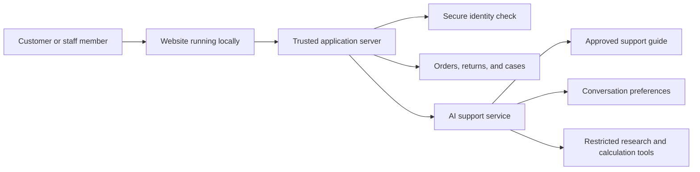
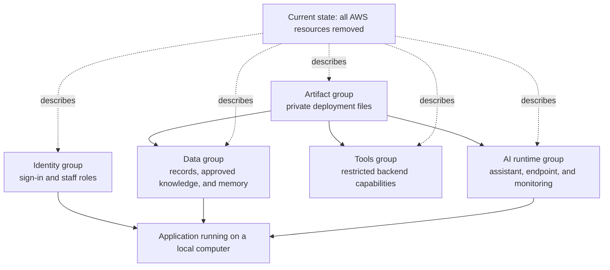

# CircuitCare AI Support

CircuitCare is a complete customer-support application for a fictional electronics retailer. It combines an AI assistant with familiar support features: secure sign-in, order history, return requests, safety escalations, and a staff case queue.

The important idea is simple: the AI can explain and assist, but trusted application rules—not the AI—decide what a customer may see or change.

> **Current status:** CircuitCare is not online as a public service. The complete system was deployed to Amazon Web Services (AWS), tested successfully with fictional users and data, and then removed to avoid ongoing cloud costs. It can be deployed again and used from a local computer.

## The 30-second overview

Imagine a customer who has bought electronics from CircuitCare:

1. The customer signs in and sees only their own orders.
2. They can ask the AI assistant a product or troubleshooting question.
3. The assistant answers from approved CircuitCare information instead of guessing.
4. The customer can request a return, but the application independently checks the delivery status and return window.
5. A return is shown for review before the customer confirms it.
6. A safety concern can become a support case for a human specialist.
7. A staff member uses a separate queue to review and resolve that case.

All customers, orders, and support records in this repository are fictional.

## What people can do

### As a customer

- Sign in through a hosted login page.
- Chat with an AI support assistant.
- Get answers grounded in an approved product and policy guide.
- View personal orders without seeing another customer's information.
- Review tracking information and delivery status.
- Request an eligible return and explicitly confirm it.
- Open a support case and return later to read the staff resolution.

### As a support specialist

- Sign in with a staff role.
- View the shared support-case queue.
- Move cases through their support lifecycle.
- Add a resolution that becomes visible to the customer.

## A complete customer journey

Suppose Jane notices that a device becomes unusually warm while charging. She signs in, asks the assistant what to do, and receives safety-focused guidance based on CircuitCare's approved information. She then creates a support case.

Maya, a support specialist, signs in to the staff queue. She can see Jane's case but cannot impersonate Jane or use the AI to bypass the application's rules. Maya records a resolution. When Jane returns to her case list, she can see that the case is resolved and read the response.

Returns follow the same safety pattern. The AI may explain the policy, but it cannot create or approve a return. The application checks who owns the order, whether it was delivered, and whether it is still inside the correct return window. It then presents a proposal for confirmation. Repeating the same confirmed request is safe and does not create duplicates.

## How the AI is kept in the right role

AI-generated text is useful, but it should not be trusted to make security or financial decisions. CircuitCare therefore separates conversation from authority:

- The AI explains products, policies, troubleshooting, and next steps.
- The application verifies the signed-in person before returning any records.
- Fixed business rules decide whether a return is eligible.
- The customer must confirm a return after reviewing it.
- Duplicate confirmations produce the original result instead of a second return.
- The AI never receives a general-purpose tool for reading every order or changing business records.
- Web browsing is restricted to approved, public informational websites and cannot perform logins or purchases.

This means that a convincing but incorrect AI response cannot override ownership, return, or staff-access rules.

## System architecture diagram: how a request moves



In plain language:

1. The website sends a request to the trusted application server.
2. The server checks the person's verified identity and role.
3. Business requests go directly to the records and rules controlled by the application.
4. Conversation requests go to the AI support service.
5. The AI can consult approved support information and narrowly limited tools.
6. The server sends the result back to the website. AWS credentials always remain on the server and never enter the person's browser.

## Technology guide in plain English

You do not need to know these services to understand the project. Each one has a narrow job:

| Technology | What it means here |
| --- | --- |
| React | Builds the screens that customers and staff see in their web browser. |
| FastAPI | Runs the trusted local server that receives requests and applies application rules. |
| Amazon Cognito | Provides the sign-in page and proves who the signed-in person is. |
| Amazon DynamoDB | Stores fictional orders, returns, support cases, and audit records. |
| Amazon Bedrock | Provides the language model used by the support assistant. |
| Bedrock Knowledge Base | Searches the approved CircuitCare support guide so answers can be grounded in known information. |
| Bedrock AgentCore Runtime | Runs the AI assistant in a managed AWS environment. |
| AgentCore Memory | Preserves useful conversation preferences between sessions. |
| AgentCore Gateway | Gives the assistant access to a deliberately small set of approved tools. |
| AgentCore Browser | Opens approved public information pages in an isolated browser. It cannot log in or buy anything. |
| AgentCore Code Interpreter | Performs calculations in an isolated environment instead of relying on mental arithmetic from the language model. |
| AWS Lambda | Runs small backend tools only when they are called. |
| API Gateway | Provides a controlled web address for one of those backend tools. |
| CloudFormation | Describes the AWS environment as reviewable files so it can be created and removed consistently. |
| GitHub Actions | Repeats the automated tests, code-quality checks, and builds after changes are pushed. |

## Cloud resources and current deployment status

The AWS environment is divided into five groups so each area has a clear purpose and can be removed independently:



As of 2026-09-08, none of these resources is deployed. During the latest validation cycle, the five groups were created in the AWS `us-east-1` region, tested together, and removed afterward. The website and its trusted API are intentionally designed to run on a local computer rather than as a permanently hosted service.

The diagram contains only resources that were actually deployed and verified during that cycle. It does not mix planned resources with deployment evidence, and no additional AWS components are currently planned or presented as available.

## What was tested

The complete system was tested locally and during a bounded AWS deployment using three fictional identities and synthetic order records. Checks covered:

- Customer and staff sign-in.
- Separation between different customers' records.
- Eligible and expired returns.
- Confirmation, duplicate requests, and changed-request protection.
- Safety case creation, staff resolution, and customer follow-up.
- Answers grounded in the approved support guide.
- Refusal to invent an unsupported product fact.
- Resistance to requests for hidden instructions or other customers' data.
- Restricted browsing and refusal to perform an online purchase.
- Calculations in the isolated code environment.
- Remembering a support preference across sessions.
- Deployment, removal, and checks for leftover AWS resources.

The repository also contains 30 versioned evaluation scenarios and 30 automated Python tests. Frontend tests, linting, type checks, infrastructure validation, and production builds run through the project's check script and GitHub Actions. See [validation details](docs/validation.md) for the exact scope and limitations of the live cycle.

## Security and privacy choices

- Public registration is disabled; an operator creates fictional demo users.
- The server derives customer access from verified sign-in information rather than accepting a customer number from the browser.
- Requests for another customer's records return the same kind of response as a missing record, reducing information leakage.
- Changes require protection against forged browser requests.
- Return confirmation is transactional: related records either succeed together or do not change at all.
- Audit records capture confirmed return actions.
- Credentials, account identifiers, session tokens, and raw private conversations are not published.
- The browser receives no AWS credentials.

For the detailed threat boundaries, see the [security model](docs/security.md).

## Important limitations

CircuitCare is a bounded reference application, not a live retail service.

- It uses a small fictional product guide and synthetic records.
- It does not issue real refunds or move money.
- It does not contact delivery companies or send notifications.
- It does not connect to a real customer-support platform.
- Demo users must be created by the operator after deployment.
- The application depends on AWS for live AI responses; it has no simulated AI backend.
- It has no availability commitment because the AWS resources are normally offline.
- A short validation cycle cannot demonstrate the long-term reliability, scale, or cost of a production service.

## Running the project locally with AWS

This section is for someone who wants to operate the application. A non-technical reader can stop here without missing the product explanation.

### Before you begin

You need:

- An AWS account with permission to create the documented resources.
- AWS command-line credentials configured on your computer.
- Python 3.13 for the server.
- Node.js 22 for the website.
- AWS CLI v2 plus Bash, `zip`, `jq`, `shasum`, and `uuidgen`.

AWS may charge for the temporary resources. Review the services and set a budget before deploying.

### 1. Build and check everything

From the repository folder, run:

```bash
./scripts/build.sh
./scripts/check.sh
```

The build command installs the locked dependencies and prepares the website and AWS packages. The check command runs the automated tests, code-quality checks, infrastructure validation, and production web build.

### 2. Deploy the temporary AWS environment

After confirming that the AWS command line is using the intended account and region:

```bash
./scripts/preflight.sh
./scripts/deploy.sh
```

The deployment creates five CloudFormation stacks in `us-east-1`: `ai-support-agent-identity`, `ai-support-agent-bootstrap`, `ai-support-agent-data`, `ai-support-agent-tools`, and `ai-support-agent-runtime`. It also uploads and indexes the fictional support guide. Generated deployment identifiers are written only to the ignored `.evidence` directory.

### 3. Create fictional demo users and records

Use the `UserPoolId` and `BusinessTableName` values produced by the deployment:

```bash
.venv/bin/python scripts/seed.py \
  --user-pool-id <UserPoolId> \
  --table-name <BusinessTableName>
```

The script securely asks for a demo password and creates Jane, Bob, and Maya together with deterministic fictional orders.

### 4. Start the local website

Copy `.env.example` to `.env.local`, fill in the values from the deployment output, and generate a strong random `SESSION_SECRET`. Then run:

```bash
./scripts/dev.sh
```

Open `http://127.0.0.1:8000`. The website runs on the local computer, while its AI and data services use the temporary AWS environment.

### 5. Remove the AWS environment

When testing is complete, run:

```bash
./scripts/teardown.sh
```

The script removes the five stacks in dependency order and deletes the retained deployment bucket. Because some AWS services create logs outside the stacks, perform the project-specific tagged-resource and log-group audit described in the [development and AWS validation guide](docs/development-guide.md).

## Repository map

| Location | Contents |
| --- | --- |
| `apps/web` | Customer website and staff queue. |
| `apps/api` | Trusted local API, sign-in flow, and connection to the AI runtime. |
| `domain` | Orders, returns, cases, ownership rules, and DynamoDB storage. |
| `support_agent` | AI instructions and controlled knowledge, memory, browser, and calculation integrations. |
| `infrastructure` | The five CloudFormation templates that define the temporary AWS environment. |
| `knowledge` | Fictional support information used to ground answers. |
| `evals` | Versioned evaluation scenarios. |
| `tests` | Automated checks for deterministic behavior. |
| `scripts` | Build, validation, deployment, seeding, local startup, and teardown commands. |

More technical detail is available in [architecture and operations](docs/architecture.md), [development setup](docs/development-guide.md), [security](docs/security.md), and [validation](docs/validation.md).

Licensed under the MIT License.
