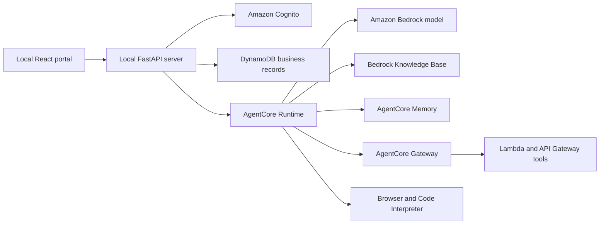
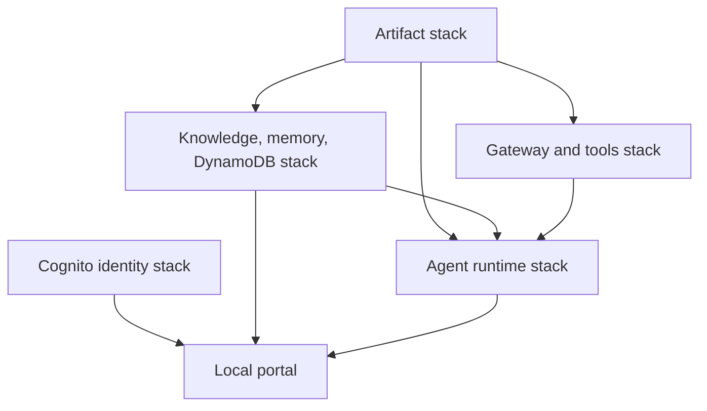

# CircuitCare AI Support

CircuitCare is a customer-support application for a fictional electronics retailer. Customers can ask grounded product questions, view their orders, request eligible returns, and follow cases escalated to a support specialist. A focused staff queue completes the escalation journey.

## Purpose and usefulness

The application is useful for showing how an AI assistant can sit beside authoritative business workflows without controlling their security or transaction rules. The scenario and records are fictional.

## Capabilities

- Responsive customer portal with support chat, orders, returns, and cases.
- Staff queue for reviewing and resolving escalations.
- Grounded answers from an Amazon Bedrock Knowledge Base.
- Amazon Bedrock AgentCore Runtime, Memory, Browser, and Code Interpreter integrations.
- Cognito sign-in with seeded customer and staff identities.
- DynamoDB persistence, ownership checks, return-policy enforcement, explicit confirmation, idempotency, and audit events.
- Repeatable local checks and a bounded live AWS evaluation suite.

## System architecture diagram



The FastAPI server verifies the signed-in identity and performs all authoritative business operations. The model may explain an outcome, but it cannot approve a return, select another customer's records, or change case state. AWS credentials remain in the local server process.

## Cloud resources diagram



No resources are currently deployed. The complete application was exercised on AWS and removed on 2026-09-08 after the validation cycle described below.

## Local development

Requirements are Python 3.13, Node.js 22, AWS CLI v2, Bash, `zip`, `jq`, `shasum`, and `uuidgen`.

```bash
./scripts/build.sh
.venv/bin/pytest -q
.venv/bin/ruff check .
.venv/bin/mypy main.py support_agent lambdas domain apps/api
.venv/bin/cfn-lint infrastructure/*.yaml
cd apps/web && npm test && npm run lint && npm run build
```

The portal deliberately connects to AWS and has no simulated agent backend. After an authorized deployment, copy `.env.example` to `.env.local`, fill it from CloudFormation outputs, generate a strong local `SESSION_SECRET`, build the frontend, and run `./scripts/dev.sh`. Open `http://127.0.0.1:8000`.

See [development setup](docs/development-guide.md) for deployment, seeding, evaluation, and teardown steps.

## Exact deployment method and status

As of 2026-09-08, no CircuitCare AWS resources are deployed. The latest verification run created five CloudFormation stacks in `us-east-1`—identity, bootstrap, data, tools, and runtime—while the web application and API ran locally. The stacks and retained artifacts were removed after the checks passed.

The diagrams show the verified design and clearly mark its current offline state; no planned resource is presented as deployed.

Deployment and teardown are manual, bounded operations. They require an AWS identity with the permissions checked by `scripts/preflight.sh` and may incur charges. [AWS architecture and operations](docs/architecture.md) documents the resources and lifecycle.

## Security and limitations

Cognito registration is disabled and demo users are seeded by an operator. Customer access is derived from verified identity claims; missing and cross-customer records use non-enumerating errors. Return changes use an explicit proposal/confirmation boundary and idempotency keys. Browser activity is restricted to informational research, and deterministic code owns money and policy decisions.

This bounded reference application does not move money, contact carriers, send notifications, or integrate with a real ticketing system. The dataset and knowledge corpus are intentionally small. It has no availability commitment because it is normally offline. See the [security model](docs/security.md) and [validation criteria](docs/validation.md).

## Repository layout

- `apps/web` — React customer portal and staff queue.
- `apps/api` — local authenticated API and AgentCore client.
- `domain` — business records, rules, DynamoDB adapter, and fixtures.
- `support_agent` — agent orchestration and managed-service integrations.
- `infrastructure` — independently deployable CloudFormation stacks.
- `evals` and `tests` — live scenarios and deterministic checks.

Licensed under the MIT License.
