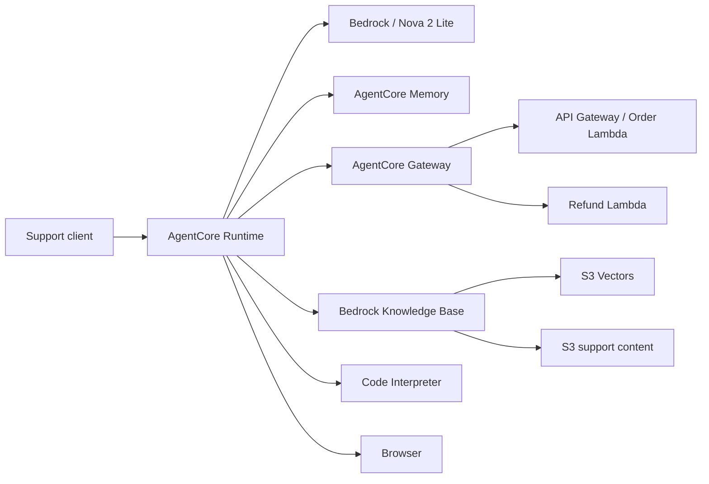
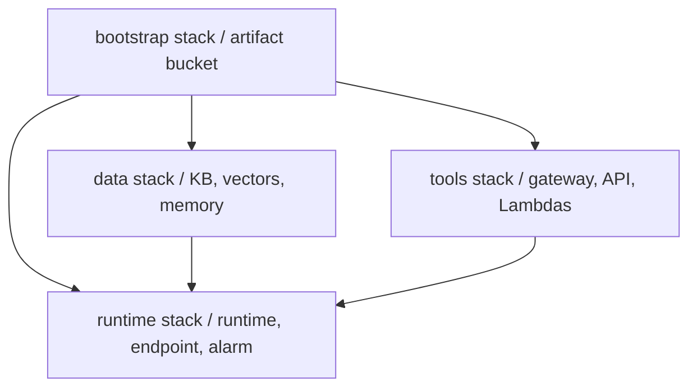

# CircuitCare AI Support Agent

CircuitCare is an AWS-native support agent for an electronics retailer. It answers grounded product and policy questions, retrieves customer and order facts, simulates bounded support operations, remembers customer preferences across sessions, and uses isolated computation when arithmetic is required.

## Purpose and usefulness

The service is useful for resolving repetitive support requests with approved information while keeping business actions behind controlled, typed tool interfaces.

## Capabilities

- Grounded answers from an Amazon Bedrock Knowledge Base backed by S3 and S3 Vectors.
- Order/customer lookups and validated refund operations through AgentCore Gateway targets.
- Cross-session preferences and summaries through AgentCore Memory.
- Loyalty calculations and public documentation research in managed Code Interpreter and Browser sandboxes.
- Strict Pydantic request/tool-result contracts and automatic conversation summarization.

The implementation uses Amazon Nova 2 Lite through Bedrock and the Strands Agents SDK. The CircuitCare scenario and operational data are fictional.

## How it works: system architecture diagram



Runtime hosts the Python agent; Bedrock supplies language reasoning; the Knowledge Base supplies approved context; and Gateway controls access to business APIs. Memory restores relevant cross-session context. Browser and Code Interpreter isolate browsing and computation in AWS-managed sessions. Tool and invocation data are validated before use, and older conversation history is summarized when it reaches 70% of the configured context budget.

## Cloud resources and deployment method

The last deployed architecture separated infrastructure by lifecycle and failure
domain:



The four templates are independently deployable. A runtime failure therefore does not recreate the long-lived knowledge, memory, or tool resources. The artifact bucket is private, encrypted, versioned, and retained by CloudFormation.

On 2026-09-08, all four `ai-support-agent-*` stacks were removed from
`us-east-1`, together with the retained artifact bucket and service-created log
groups. No project cloud resources are currently deployed. Before teardown,
knowledge ingestion and live Runtime, Gateway, Knowledge Base, Memory, Browser,
Code Interpreter, and AgentCore CLI checks succeeded; the preserved verification
records document that deployment rather than current availability.

No resources are currently deployed; any planned redeployment must use the
documented deployment procedure and a separately authorized AWS environment.

The diagram shows the previously verified deployment architecture. It is not a
claim that those resources are currently deployed.

## Live verification

See [LIVE_TEST_LOG.md](LIVE_TEST_LOG.md) for sanitized transcripts of successful
AgentCore CLI, Gateway API, Gateway Lambda, Browser, cross-session Memory,
Knowledge Base, and Code Interpreter invocations. Design decisions, a concrete
deployment challenge, and production considerations are documented in
[REFLECTION.md](REFLECTION.md).

Visual evidence:

- [AgentCore CLI invocation](verification/agentcore-cli.png)
- [API- and Lambda-backed Gateway tools](verification/gateway-tools.png)
- [Browser live-page retrieval](verification/browser-live-page.png)
- [Cross-session Memory recall](verification/memory-cross-session.png)

### Prerequisites and credentials

Install the following locally:

- AWS CLI v2
- Python 3.13 with `pip`
- Bash, `zip`, `jq`, `shasum`, and `uuidgen`
- AWS permissions for CloudFormation, IAM, Bedrock, AgentCore, S3, S3 Vectors,
  Lambda, API Gateway, and CloudWatch

Clone the repository and build the local environment and deployment artifacts:

```bash
git clone https://github.com/abdalrahmanattya/ai-support-agent.git
cd ai-support-agent
./scripts/build.sh
```

The build script installs `uv` under `.tools/`, synchronizes `.venv/`, and builds
Python 3.13 ARM64 deployment archives. Configure the AWS CLI with your own
profile or temporary credentials, then select the required region:

```bash
export AWS_PROFILE=your-deployment-profile
export AWS_REGION=us-east-1
export AWS_DEFAULT_REGION=us-east-1
aws sts get-caller-identity
```

Omit `AWS_PROFILE` when temporary credentials are already exported. Optionally
set `EXPECTED_AWS_ACCOUNT_ID` and `EXPECTED_AWS_ROLE_NAME` to make the preflight
script reject an unexpected deployment identity.

### Deploy and update

```bash
./scripts/preflight.sh
./scripts/deploy.sh
```

The script builds ARM64/Python 3.13 artifacts, deploys stacks in dependency order, uploads support content, and waits for ingestion. For application-only changes:

```bash
./scripts/deploy-runtime.sh
```

That command updates only the Runtime stack.

### Invoke

```bash
./scripts/invoke.sh "Where is order ORD-001?" CUST-001
```

The official AgentCore CLI can also invoke the runtime after the user registers
the CloudFormation-managed runtime in account-local AgentCore CLI state. That
state is intentionally not included because it contains deployment identifiers.

### Validate

```bash
.venv/bin/pytest -q
.venv/bin/ruff check .
.venv/bin/mypy main.py support_agent lambdas
.venv/bin/cfn-lint infrastructure/*.yaml
```

### Remove the deployment

Capture the retained artifact bucket name before deleting the stacks, then
remove the stacks in dependency order:

```bash
artifact_bucket="$(aws cloudformation describe-stacks \
  --region us-east-1 \
  --stack-name ai-support-agent-bootstrap \
  --query 'Stacks[0].Outputs[?OutputKey==`ArtifactBucketName`].OutputValue' \
  --output text)"

for stack in runtime tools data bootstrap; do
  aws cloudformation delete-stack \
    --region us-east-1 \
    --stack-name "ai-support-agent-${stack}"
  aws cloudformation wait stack-delete-complete \
    --region us-east-1 \
    --stack-name "ai-support-agent-${stack}"
done
```

The versioned artifact bucket is retained intentionally. After confirming its
artifacts and knowledge document are no longer needed, delete all object
versions and delete markers, then delete the bucket:

```bash
delete_manifest="$(mktemp)"
aws s3api list-object-versions --bucket "${artifact_bucket}" \
  | jq '{Objects: ([.Versions[]?, .DeleteMarkers[]?]
      | map({Key, VersionId})), Quiet: true}' >"${delete_manifest}"

if jq -e '.Objects | length > 0' "${delete_manifest}" >/dev/null; then
  aws s3api delete-objects \
    --bucket "${artifact_bucket}" \
    --delete "file://${delete_manifest}"
fi
aws s3api delete-bucket --bucket "${artifact_bucket}" --region us-east-1
rm "${delete_manifest}"
```

## Repository layout

- `main.py` assembles the runtime agent.
- `support_agent/` contains contracts and native-service integrations.
- `lambdas/` contains fictional business tools.
- `knowledge/` contains ingested support content.
- `infrastructure/` contains the four CloudFormation templates.
- `scripts/` automates build, deployment, and invocation.
- `tests/` verifies contracts, tools, memory compatibility, and handlers.

## Security and limitations

Gateway and Runtime use IAM authorization; no unauthenticated customer endpoint is created. The agent prompt instructs the Browser tool not to perform purchases, logins, or transactions, but this is a behavioral policy rather than a hard authorization boundary. Credentials, account-local CLI state, evidence, builds, and agent instructions are excluded from Git.

This is a backend reference service, not a chat UI. Business data and actions are simulated, human escalation has no ticketing integration, and the knowledge corpus is small. Production use would also require privacy review, evaluations, rate limits, abuse controls, and a formal retention policy.

A future deployment may incur charges for inference, Runtime, Memory, Gateway,
Browser, Code Interpreter, Knowledge Base, S3/S3 Vectors, Lambda, API Gateway,
and CloudWatch. Use the ordered removal procedure above when it is no longer
needed.
