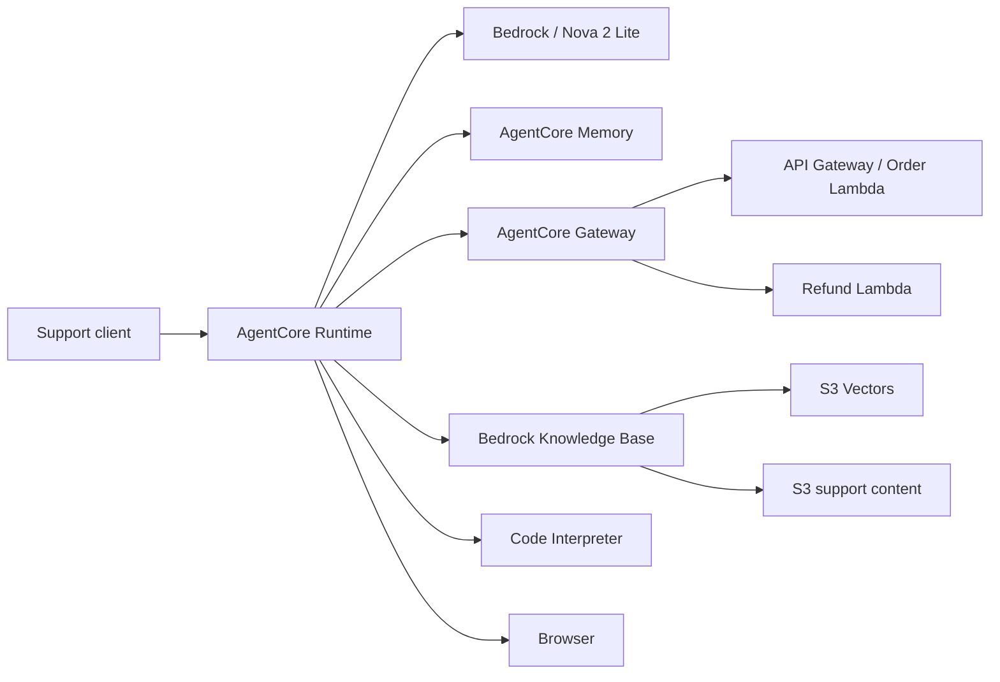
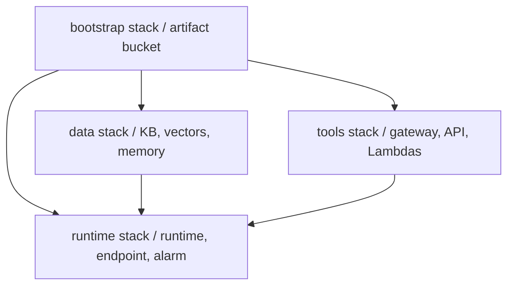

# CircuitCare AI Support Agent

CircuitCare is an AWS-native support agent for an electronics retailer. It answers grounded product and policy questions, retrieves customer and order facts, simulates bounded support operations, remembers customer preferences across sessions, and uses isolated computation when arithmetic is required.

## Purpose and usefulness

The service is useful for resolving repetitive support requests with approved information while keeping business actions behind controlled, typed tool interfaces.

## Capabilities

- Grounded answers from an Amazon Bedrock Knowledge Base backed by S3 and S3 Vectors.
- Order/customer lookups and validated refund operations through AgentCore Gateway targets.
- Cross-session preferences and summaries through AgentCore Memory.
- Loyalty calculations and public documentation research in managed Code Interpreter and Browser sandboxes.
- Strict Pydantic request/tool-result contracts and automatic conversation summarization.

The implementation uses Amazon Nova 2 Lite through Bedrock and the Strands Agents SDK. The CircuitCare scenario and operational data are fictional.

## How it works: system architecture diagram



Runtime hosts the Python agent; Bedrock supplies language reasoning; the Knowledge Base supplies approved context; and Gateway controls access to business APIs. Memory restores relevant cross-session context. Browser and Code Interpreter isolate browsing and computation in AWS-managed sessions. Tool and invocation data are validated before use, and older conversation history is summarized when it reaches 70% of the configured context budget.

## Cloud resources and deployment method

The infrastructure is separated by lifecycle and failure domain:



The four templates are independently deployable. A runtime failure therefore does not recreate the long-lived knowledge, memory, or tool resources. The artifact bucket is private, encrypted, versioned, and retained by CloudFormation.

As of 2026-09-08, all four `ai-support-agent-*` stacks are deployed in `us-east-1`. Knowledge ingestion and live Runtime, Gateway, Knowledge Base, Memory, Browser, Code Interpreter, and AgentCore CLI checks have succeeded. This dated status does not guarantee later availability.

The diagram shows currently deployed resources; no planned resources are presented as deployed.

### Prerequisites and credentials

Use AWS CLI v2, Python 3.13, `uv`, and AWS access that can assume the deployment role. Node.js is only needed for the optional official AgentCore CLI. Source the local ignored credential helper:

```bash
source <(./refresh-credentials.sh)
```

It obtains temporary role credentials without writing them into the repository.
Set `EXPECTED_AWS_ACCOUNT_ID` and `EXPECTED_AWS_ROLE_NAME` when you want the
preflight script to enforce a specific deployment identity.

### Deploy and update

```bash
./scripts/preflight.sh
./scripts/deploy.sh
```

The script builds ARM64/Python 3.13 artifacts, deploys stacks in dependency order, uploads support content, and waits for ingestion. For application-only changes:

```bash
./scripts/deploy-runtime.sh
```

That command updates only the Runtime stack.

### Invoke

```bash
./scripts/invoke.sh "Where is order ORD-001?" CUST-001
```

The current official Node CLI also works after installing `@aws/agentcore` and registering the CloudFormation-managed runtime in ignored local `agentcore/` state:

```bash
agentcore invoke --runtime ai_support_agent --target development \
  --prompt "What can CircuitCare help with?" --user-id CUST-001 --json
```

### Validate

```bash
.venv/bin/pytest -q
.venv/bin/ruff check .
.venv/bin/mypy main.py support_agent lambdas
.venv/bin/cfn-lint infrastructure/*.yaml
```

## Repository layout

- `main.py` assembles the runtime agent.
- `support_agent/` contains contracts and native-service integrations.
- `lambdas/` contains fictional business tools.
- `knowledge/` contains ingested support content.
- `infrastructure/` contains the four CloudFormation templates.
- `scripts/` automates build, deployment, and invocation.
- `tests/` verifies contracts, tools, memory compatibility, and handlers.

## Security and limitations

Gateway and Runtime use IAM authorization; no unauthenticated customer endpoint is created. Browser instructions prohibit purchases, logins, and transactions. Credentials, account-local CLI state, evidence, builds, and agent instructions are excluded from Git.

This is a backend reference service, not a chat UI. Business data and actions are simulated, human escalation has no ticketing integration, and the knowledge corpus is small. Production use would also require privacy review, evaluations, rate limits, abuse controls, and a formal retention policy.

Deployed resources may incur charges for inference, Runtime, Memory, Gateway, Browser, Code Interpreter, Knowledge Base, S3/S3 Vectors, Lambda, API Gateway, and CloudWatch. Delete the four stacks when no longer needed. The retained artifact bucket must be emptied and removed separately only after confirming its contents are no longer required.
